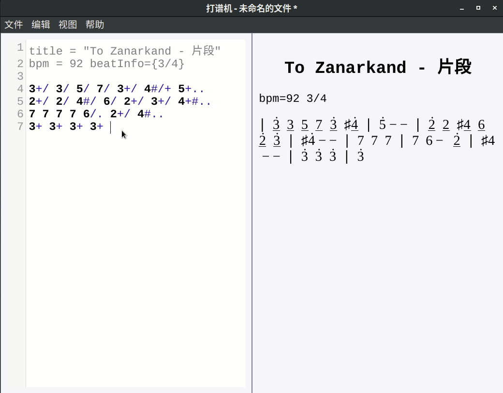
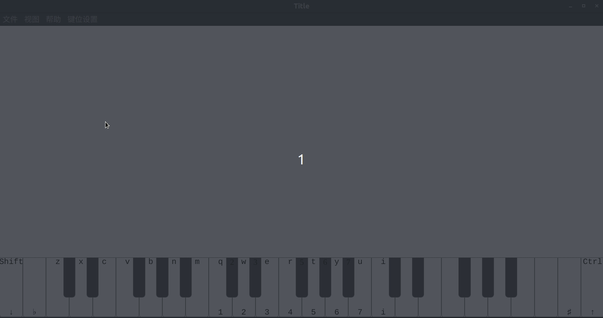
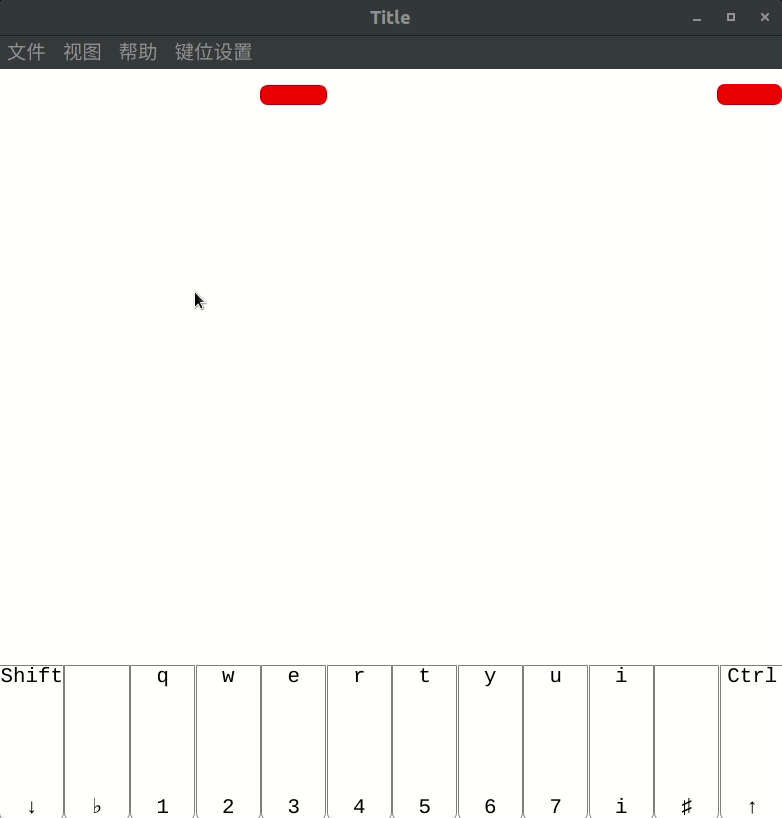

# 打谱机

## 版本：0.1.1

一款用electron框架创建的编写简谱、播放简谱、练习和辅助演奏的软件

## 用法

### 直接从源码运行

从源码运行打谱机需要Nodejs，可以从[Nodejs官网安装](https://nodejs.org)。安装好Nodejs后确认```node```和```npm```这两个命令可以使用。

> 注：```npm```是Nodejs的包管理器，国内下载速度很不稳定，可以使用```cnpm```代替```npm```。用命令```npm install -g cnpm```安装```cnpm```。

进入打谱机源代码的根目录并执行如下命令即可运行打谱机，

```bash
$ npm install
$ npm start
```

### 直接下载打包好的程序

[百度网盘下载提取码：adsg](https://pan.baidu.com/s/1mMlta4AeOBzUCEECWH0PNQ)

当然你若需要自己打包的话想要在Windows以外的系统运行（比如linux、OSX），可以用[electron-packager](https://github.com/electron-userland/electron-packager)来打包。

### 语言切换

将```src/languages/```目录，需要调用的语言的文件名改为```seleted.js```即可。

例如：默认的```seleted.js```里为中文，若要换成英文，则将原本的```seleted.js```删除，将```en.js```改名为```seleted.js```重启程序即可。

## 功能

* 通过简单的代码（遵守打谱机的语法）来编写乐谱




* 播放乐谱代码
* 通过手柄或键盘进行演奏
* 根据乐谱代码来生成类似音乐游戏的滑动条，用以练习和辅助演奏

<span></span>


## 打谱机语法

乐谱代码总体分为两部分**乐谱头部**和**乐谱正文**：

### 1. 乐谱头部

**乐谱头部**记录整个乐谱的相关信息，且必须放在**乐谱正文**之前。

**乐谱头部**可以包含如下信息：

```
title = "标题名"
composer = "作曲者姓名"
compiler = "打谱者姓名"
bpm = a // 每分钟节拍数(beats per minute)。默认为80, 0<a
beatInfo = {a/b} // 表示每小节有a拍，b分音符为1拍。默认为4/4, a={2,3,4,5,6,7,8}, b={1,2,4,8,16,32,64}
```

### 2. 乐谱正文

**乐谱正文**由任意数量的**乐谱标记**组成，一个**乐谱标记**包含一个**唱名**和任意数量的**乐谱符号**，**乐谱符号**之间没有顺序。例如```1#+*.```表示一个高八度升了半音拍子为3拍的do，即用简谱记为$$\sharp \dot{1}--$$。

### 唱名

```
1, 2, 3, 4, 5, 6, 7
```
### 乐谱符号

```
b - 升调符号
# - 降调符号
/ - 音长减半
* - 音长翻倍
. - 音长加一拍
- - 音高降低
+ - 音高升高
0 - 修止符号
```

## 代码结构（正在整理）

